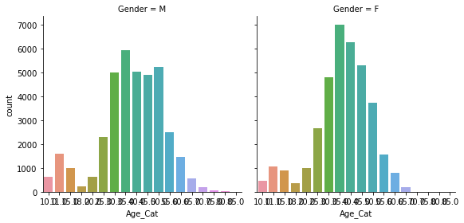

# Exploratory Data Analysis on the Malahide Park Run


```python
import pandas as pd
import matplotlib.pyplot as plt
import seaborn as sns
import numpy as np
import scipy.stats as stats
%matplotlib inline
```

### Import the data file.<br>Some cleaning has already been done in Notepad and Excel


```python
path_to_file = 'C:\Users\Administrator\Documents\Python Scripts\examplepark.csv'
data = pd.read_csv(path_to_file)
```


```python
data['Time'] = ((pd.to_numeric(data['Time'].str.slice(0,2)))*60)+(pd.to_numeric(data['Time'].str.slice(3,5)))+((pd.to_numeric(data['Time'].str.slice(6,8)))/60)
data['Date'] = pd.to_datetime(data['Date'],errors='coerce', format='%d-%m-%Y')
data['Age_Cat'] = pd.to_numeric(data['Age_Cat'].str.slice(2,4),errors='coerce', downcast='signed')
data['Age_Grade'] = pd.to_numeric(data['Age_Grade'].str.slice(0,5),errors='coerce')
data.head(10)
```


<div>
<style>
    .dataframe thead tr:only-child th {
        text-align: right;
    }

    .dataframe thead th {
        text-align: left;
    }

    .dataframe tbody tr th {
        vertical-align: top;
    }
</style>
<table border="1" class="dataframe">
  <thead>
    <tr style="text-align: right;">
      <th></th>
      <th>Date</th>
      <th>Pos</th>
      <th>Name</th>
      <th>Time</th>
      <th>Age_Cat</th>
      <th>Age_Grade</th>
      <th>Gender</th>
      <th>Gen_Pos</th>
      <th>Club</th>
      <th>Note</th>
      <th>Total_Runs</th>
      <th>Run_No.</th>
    </tr>
  </thead>
  <tbody>
    <tr>
      <th>0</th>
      <td>2012-11-10</td>
      <td>1</td>
      <td>Michael MCSWIGGAN</td>
      <td>18.316667</td>
      <td>35.0</td>
      <td>73.43</td>
      <td>M</td>
      <td>1.0</td>
      <td>Portmarnock Athletic Club</td>
      <td>First Timer!</td>
      <td>29.0</td>
      <td>1</td>
    </tr>
    <tr>
      <th>1</th>
      <td>2012-11-10</td>
      <td>2</td>
      <td>Alan FOLEY</td>
      <td>18.433333</td>
      <td>30.0</td>
      <td>71.16</td>
      <td>M</td>
      <td>2.0</td>
      <td>Raheny Shamrock AC</td>
      <td>First Timer!</td>
      <td>99.0</td>
      <td>1</td>
    </tr>
    <tr>
      <th>2</th>
      <td>2012-11-10</td>
      <td>3</td>
      <td>Matt SHIELDS</td>
      <td>18.533333</td>
      <td>55.0</td>
      <td>85.07</td>
      <td>M</td>
      <td>3.0</td>
      <td>North Belfast Harriers</td>
      <td>First Timer!</td>
      <td>274.0</td>
      <td>1</td>
    </tr>
    <tr>
      <th>3</th>
      <td>2012-11-10</td>
      <td>4</td>
      <td>David GARGAN</td>
      <td>18.650000</td>
      <td>40.0</td>
      <td>73.73</td>
      <td>M</td>
      <td>4.0</td>
      <td>Raheny Shamrock AC</td>
      <td>First Timer!</td>
      <td>107.0</td>
      <td>1</td>
    </tr>
    <tr>
      <th>4</th>
      <td>2012-11-10</td>
      <td>5</td>
      <td>Paul SINTON-HEWITT</td>
      <td>18.900000</td>
      <td>50.0</td>
      <td>79.28</td>
      <td>M</td>
      <td>5.0</td>
      <td>Ranelagh Harriers</td>
      <td>First Timer!</td>
      <td>369.0</td>
      <td>1</td>
    </tr>
    <tr>
      <th>5</th>
      <td>2012-11-10</td>
      <td>6</td>
      <td>John Gerard MURPHY</td>
      <td>20.250000</td>
      <td>40.0</td>
      <td>68.97</td>
      <td>M</td>
      <td>6.0</td>
      <td>North Belfast Harriers</td>
      <td>First Timer!</td>
      <td>342.0</td>
      <td>1</td>
    </tr>
    <tr>
      <th>6</th>
      <td>2012-11-10</td>
      <td>7</td>
      <td>Conor FITZPATRICK</td>
      <td>20.283333</td>
      <td>20.0</td>
      <td>64.26</td>
      <td>M</td>
      <td>7.0</td>
      <td>Portmarnock Athletic Club</td>
      <td>First Timer!</td>
      <td>40.0</td>
      <td>1</td>
    </tr>
    <tr>
      <th>7</th>
      <td>2012-11-10</td>
      <td>8</td>
      <td>Rachael BECK</td>
      <td>20.450000</td>
      <td>40.0</td>
      <td>76.37</td>
      <td>F</td>
      <td>1.0</td>
      <td>Fingal Triathlon Club</td>
      <td>First Timer!</td>
      <td>9.0</td>
      <td>1</td>
    </tr>
    <tr>
      <th>8</th>
      <td>2012-11-10</td>
      <td>9</td>
      <td>Des HUSIN</td>
      <td>20.533333</td>
      <td>45.0</td>
      <td>69.07</td>
      <td>M</td>
      <td>8.0</td>
      <td>NaN</td>
      <td>First Timer!</td>
      <td>296.0</td>
      <td>1</td>
    </tr>
    <tr>
      <th>9</th>
      <td>2012-11-10</td>
      <td>10</td>
      <td>John COLEMAN</td>
      <td>20.816667</td>
      <td>30.0</td>
      <td>63.01</td>
      <td>M</td>
      <td>9.0</td>
      <td>NaN</td>
      <td>First Timer!</td>
      <td>87.0</td>
      <td>1</td>
    </tr>
  </tbody>
</table>
</div>


```python
data['Club_Coded'] = data['Club'].isnull()
```


```python
def converter(Club):
    if Club==True:
        return 0
    else:
        return 1
```


```python
data['Club_Coded'] = data['Club_Coded'].apply(converter)
```


```python
data.head(10)
```


<div>
<style>
    .dataframe thead tr:only-child th {
        text-align: right;
    }

    .dataframe thead th {
        text-align: left;
    }

    .dataframe tbody tr th {
        vertical-align: top;
    }
</style>
<table border="1" class="dataframe">
  <thead>
    <tr style="text-align: right;">
      <th></th>
      <th>Date</th>
      <th>Pos</th>
      <th>Name</th>
      <th>Time</th>
      <th>Age_Cat</th>
      <th>Age_Grade</th>
      <th>Gender</th>
      <th>Gen_Pos</th>
      <th>Club</th>
      <th>Note</th>
      <th>Total_Runs</th>
      <th>Run_No.</th>
      <th>Club_Coded</th>
    </tr>
  </thead>
  <tbody>
    <tr>
      <th>0</th>
      <td>2012-11-10</td>
      <td>1</td>
      <td>Michael MCSWIGGAN</td>
      <td>18.316667</td>
      <td>35.0</td>
      <td>73.43</td>
      <td>M</td>
      <td>1.0</td>
      <td>Portmarnock Athletic Club</td>
      <td>First Timer!</td>
      <td>29.0</td>
      <td>1</td>
      <td>1</td>
    </tr>
    <tr>
      <th>1</th>
      <td>2012-11-10</td>
      <td>2</td>
      <td>Alan FOLEY</td>
      <td>18.433333</td>
      <td>30.0</td>
      <td>71.16</td>
      <td>M</td>
      <td>2.0</td>
      <td>Raheny Shamrock AC</td>
      <td>First Timer!</td>
      <td>99.0</td>
      <td>1</td>
      <td>1</td>
    </tr>
    <tr>
      <th>2</th>
      <td>2012-11-10</td>
      <td>3</td>
      <td>Matt SHIELDS</td>
      <td>18.533333</td>
      <td>55.0</td>
      <td>85.07</td>
      <td>M</td>
      <td>3.0</td>
      <td>North Belfast Harriers</td>
      <td>First Timer!</td>
      <td>274.0</td>
      <td>1</td>
      <td>1</td>
    </tr>
    <tr>
      <th>3</th>
      <td>2012-11-10</td>
      <td>4</td>
      <td>David GARGAN</td>
      <td>18.650000</td>
      <td>40.0</td>
      <td>73.73</td>
      <td>M</td>
      <td>4.0</td>
      <td>Raheny Shamrock AC</td>
      <td>First Timer!</td>
      <td>107.0</td>
      <td>1</td>
      <td>1</td>
    </tr>
    <tr>
      <th>4</th>
      <td>2012-11-10</td>
      <td>5</td>
      <td>Paul SINTON-HEWITT</td>
      <td>18.900000</td>
      <td>50.0</td>
      <td>79.28</td>
      <td>M</td>
      <td>5.0</td>
      <td>Ranelagh Harriers</td>
      <td>First Timer!</td>
      <td>369.0</td>
      <td>1</td>
      <td>1</td>
    </tr>
    <tr>
      <th>5</th>
      <td>2012-11-10</td>
      <td>6</td>
      <td>John Gerard MURPHY</td>
      <td>20.250000</td>
      <td>40.0</td>
      <td>68.97</td>
      <td>M</td>
      <td>6.0</td>
      <td>North Belfast Harriers</td>
      <td>First Timer!</td>
      <td>342.0</td>
      <td>1</td>
      <td>1</td>
    </tr>
    <tr>
      <th>6</th>
      <td>2012-11-10</td>
      <td>7</td>
      <td>Conor FITZPATRICK</td>
      <td>20.283333</td>
      <td>20.0</td>
      <td>64.26</td>
      <td>M</td>
      <td>7.0</td>
      <td>Portmarnock Athletic Club</td>
      <td>First Timer!</td>
      <td>40.0</td>
      <td>1</td>
      <td>1</td>
    </tr>
    <tr>
      <th>7</th>
      <td>2012-11-10</td>
      <td>8</td>
      <td>Rachael BECK</td>
      <td>20.450000</td>
      <td>40.0</td>
      <td>76.37</td>
      <td>F</td>
      <td>1.0</td>
      <td>Fingal Triathlon Club</td>
      <td>First Timer!</td>
      <td>9.0</td>
      <td>1</td>
      <td>1</td>
    </tr>
    <tr>
      <th>8</th>
      <td>2012-11-10</td>
      <td>9</td>
      <td>Des HUSIN</td>
      <td>20.533333</td>
      <td>45.0</td>
      <td>69.07</td>
      <td>M</td>
      <td>8.0</td>
      <td>NaN</td>
      <td>First Timer!</td>
      <td>296.0</td>
      <td>1</td>
      <td>0</td>
    </tr>
    <tr>
      <th>9</th>
      <td>2012-11-10</td>
      <td>10</td>
      <td>John COLEMAN</td>
      <td>20.816667</td>
      <td>30.0</td>
      <td>63.01</td>
      <td>M</td>
      <td>9.0</td>
      <td>NaN</td>
      <td>First Timer!</td>
      <td>87.0</td>
      <td>1</td>
      <td>0</td>
    </tr>
  </tbody>
</table>
</div>


```python
ax = data.groupby('Date').count()['Pos'].plot.line(figsize=(8, 6), fontsize=20)
ax.set_xlabel("Date", fontsize=20)
ax.set_ylabel("Runner Count", fontsize=20)
ax.grid('on', which='major', axis='x')
ax.grid('on', which='major', axis='y')
```


```python
# seems to be some seasonality
```


```python
data.groupby('Date').mean()['Time'].plot.line(figsize=(4, 3), fontsize=20)
data.groupby('Date').min()['Time'].plot.line()
data.groupby('Date').max()['Time'].plot.line()
```


    <matplotlib.axes._subplots.AxesSubplot at 0x23874ac8>


```python
data.groupby('Date').min()['Time'].plot.line(figsize=(4, 3), fontsize=20)
data.groupby('Date').max()['Time'].plot.line()
```


    <matplotlib.axes._subplots.AxesSubplot at 0x24e70f28>


```python
## doesnt seem to be any change in time over time
```


```python
data.groupby('Date').std()['Time'].plot.line(figsize=(4, 3), fontsize=20)
```


    <matplotlib.axes._subplots.AxesSubplot at 0x255b50f0>


```python
df3 = data.dropna(subset=['Age_Grade'])
#df3['Age_Grade'].dropna()
df3['Rounded_Age_Grade'] = df3['Age_Grade'].apply(lambda x: x//2)
df3['Rounded_Age_Grade'] = df3['Rounded_Age_Grade'].apply(lambda x: int(x*2))
```

    C:\ProgramData\Anaconda2\lib\site-packages\ipykernel_launcher.py:3: SettingWithCopyWarning: 
    A value is trying to be set on a copy of a slice from a DataFrame.
    Try using .loc[row_indexer,col_indexer] = value instead
    
    See the caveats in the documentation: http://pandas.pydata.org/pandas-docs/stable/indexing.html#indexing-view-versus-copy
      This is separate from the ipykernel package so we can avoid doing imports until
    C:\ProgramData\Anaconda2\lib\site-packages\ipykernel_launcher.py:4: SettingWithCopyWarning: 
    A value is trying to be set on a copy of a slice from a DataFrame.
    Try using .loc[row_indexer,col_indexer] = value instead
    
    See the caveats in the documentation: http://pandas.pydata.org/pandas-docs/stable/indexing.html#indexing-view-versus-copy
      after removing the cwd from sys.path.
    


```python
df3.head(20)
```


<div>
<style>
    .dataframe thead tr:only-child th {
        text-align: right;
    }

    .dataframe thead th {
        text-align: left;
    }

    .dataframe tbody tr th {
        vertical-align: top;
    }
</style>
<table border="1" class="dataframe">
  <thead>
    <tr style="text-align: right;">
      <th></th>
      <th>Date</th>
      <th>Pos</th>
      <th>Name</th>
      <th>Time</th>
      <th>Age_Cat</th>
      <th>Age_Grade</th>
      <th>Gender</th>
      <th>Gen_Pos</th>
      <th>Club</th>
      <th>Note</th>
      <th>Total_Runs</th>
      <th>Run_No.</th>
      <th>Club_Coded</th>
      <th>Rounded_Age_Grade</th>
    </tr>
  </thead>
  <tbody>
    <tr>
      <th>0</th>
      <td>2012-11-10</td>
      <td>1</td>
      <td>Michael MCSWIGGAN</td>
      <td>18.316667</td>
      <td>35.0</td>
      <td>73.43</td>
      <td>M</td>
      <td>1.0</td>
      <td>Portmarnock Athletic Club</td>
      <td>First Timer!</td>
      <td>29.0</td>
      <td>1</td>
      <td>1</td>
      <td>72</td>
    </tr>
    <tr>
      <th>1</th>
      <td>2012-11-10</td>
      <td>2</td>
      <td>Alan FOLEY</td>
      <td>18.433333</td>
      <td>30.0</td>
      <td>71.16</td>
      <td>M</td>
      <td>2.0</td>
      <td>Raheny Shamrock AC</td>
      <td>First Timer!</td>
      <td>99.0</td>
      <td>1</td>
      <td>1</td>
      <td>70</td>
    </tr>
    <tr>
      <th>2</th>
      <td>2012-11-10</td>
      <td>3</td>
      <td>Matt SHIELDS</td>
      <td>18.533333</td>
      <td>55.0</td>
      <td>85.07</td>
      <td>M</td>
      <td>3.0</td>
      <td>North Belfast Harriers</td>
      <td>First Timer!</td>
      <td>274.0</td>
      <td>1</td>
      <td>1</td>
      <td>84</td>
    </tr>
    <tr>
      <th>3</th>
      <td>2012-11-10</td>
      <td>4</td>
      <td>David GARGAN</td>
      <td>18.650000</td>
      <td>40.0</td>
      <td>73.73</td>
      <td>M</td>
      <td>4.0</td>
      <td>Raheny Shamrock AC</td>
      <td>First Timer!</td>
      <td>107.0</td>
      <td>1</td>
      <td>1</td>
      <td>72</td>
    </tr>
    <tr>
      <th>4</th>
      <td>2012-11-10</td>
      <td>5</td>
      <td>Paul SINTON-HEWITT</td>
      <td>18.900000</td>
      <td>50.0</td>
      <td>79.28</td>
      <td>M</td>
      <td>5.0</td>
      <td>Ranelagh Harriers</td>
      <td>First Timer!</td>
      <td>369.0</td>
      <td>1</td>
      <td>1</td>
      <td>78</td>
    </tr>
    <tr>
      <th>5</th>
      <td>2012-11-10</td>
      <td>6</td>
      <td>John Gerard MURPHY</td>
      <td>20.250000</td>
      <td>40.0</td>
      <td>68.97</td>
      <td>M</td>
      <td>6.0</td>
      <td>North Belfast Harriers</td>
      <td>First Timer!</td>
      <td>342.0</td>
      <td>1</td>
      <td>1</td>
      <td>68</td>
    </tr>
    <tr>
      <th>6</th>
      <td>2012-11-10</td>
      <td>7</td>
      <td>Conor FITZPATRICK</td>
      <td>20.283333</td>
      <td>20.0</td>
      <td>64.26</td>
      <td>M</td>
      <td>7.0</td>
      <td>Portmarnock Athletic Club</td>
      <td>First Timer!</td>
      <td>40.0</td>
      <td>1</td>
      <td>1</td>
      <td>64</td>
    </tr>
    <tr>
      <th>7</th>
      <td>2012-11-10</td>
      <td>8</td>
      <td>Rachael BECK</td>
      <td>20.450000</td>
      <td>40.0</td>
      <td>76.37</td>
      <td>F</td>
      <td>1.0</td>
      <td>Fingal Triathlon Club</td>
      <td>First Timer!</td>
      <td>9.0</td>
      <td>1</td>
      <td>1</td>
      <td>76</td>
    </tr>
    <tr>
      <th>8</th>
      <td>2012-11-10</td>
      <td>9</td>
      <td>Des HUSIN</td>
      <td>20.533333</td>
      <td>45.0</td>
      <td>69.07</td>
      <td>M</td>
      <td>8.0</td>
      <td>NaN</td>
      <td>First Timer!</td>
      <td>296.0</td>
      <td>1</td>
      <td>0</td>
      <td>68</td>
    </tr>
    <tr>
      <th>9</th>
      <td>2012-11-10</td>
      <td>10</td>
      <td>John COLEMAN</td>
      <td>20.816667</td>
      <td>30.0</td>
      <td>63.01</td>
      <td>M</td>
      <td>9.0</td>
      <td>NaN</td>
      <td>First Timer!</td>
      <td>87.0</td>
      <td>1</td>
      <td>0</td>
      <td>62</td>
    </tr>
    <tr>
      <th>10</th>
      <td>2012-11-10</td>
      <td>11</td>
      <td>Sean MCGOLDRICK</td>
      <td>20.983333</td>
      <td>50.0</td>
      <td>71.41</td>
      <td>M</td>
      <td>10.0</td>
      <td>Raheny Shamrock AC</td>
      <td>First Timer!</td>
      <td>106.0</td>
      <td>1</td>
      <td>1</td>
      <td>70</td>
    </tr>
    <tr>
      <th>11</th>
      <td>2012-11-10</td>
      <td>12</td>
      <td>David O HARA</td>
      <td>21.033333</td>
      <td>45.0</td>
      <td>67.43</td>
      <td>M</td>
      <td>11.0</td>
      <td>Raheny Shamrock AC</td>
      <td>First Timer!</td>
      <td>61.0</td>
      <td>1</td>
      <td>1</td>
      <td>66</td>
    </tr>
    <tr>
      <th>13</th>
      <td>2012-11-10</td>
      <td>14</td>
      <td>Philip WALLNUTT</td>
      <td>21.450000</td>
      <td>45.0</td>
      <td>67.13</td>
      <td>M</td>
      <td>13.0</td>
      <td>NaN</td>
      <td>First Timer!</td>
      <td>120.0</td>
      <td>1</td>
      <td>0</td>
      <td>66</td>
    </tr>
    <tr>
      <th>14</th>
      <td>2012-11-10</td>
      <td>15</td>
      <td>Gerard TYRRELL</td>
      <td>21.583333</td>
      <td>35.0</td>
      <td>61.47</td>
      <td>M</td>
      <td>14.0</td>
      <td>Fingal Triathlon Club</td>
      <td>First Timer!</td>
      <td>30.0</td>
      <td>1</td>
      <td>1</td>
      <td>60</td>
    </tr>
    <tr>
      <th>15</th>
      <td>2012-11-10</td>
      <td>16</td>
      <td>Seamus RUDDY</td>
      <td>21.616667</td>
      <td>30.0</td>
      <td>60.68</td>
      <td>M</td>
      <td>15.0</td>
      <td>NaN</td>
      <td>First Timer!</td>
      <td>11.0</td>
      <td>1</td>
      <td>0</td>
      <td>60</td>
    </tr>
    <tr>
      <th>16</th>
      <td>2012-11-10</td>
      <td>17</td>
      <td>Gavin KEATING</td>
      <td>21.066667</td>
      <td>35.0</td>
      <td>61.62</td>
      <td>M</td>
      <td>16.0</td>
      <td>Portmarnock Athletic Club</td>
      <td>First Timer!</td>
      <td>10.0</td>
      <td>1</td>
      <td>1</td>
      <td>60</td>
    </tr>
    <tr>
      <th>17</th>
      <td>2012-11-10</td>
      <td>18</td>
      <td>Keith FOGARTY</td>
      <td>21.700000</td>
      <td>35.0</td>
      <td>61.14</td>
      <td>M</td>
      <td>17.0</td>
      <td>NaN</td>
      <td>First Timer!</td>
      <td>1.0</td>
      <td>1</td>
      <td>0</td>
      <td>60</td>
    </tr>
    <tr>
      <th>18</th>
      <td>2012-11-10</td>
      <td>19</td>
      <td>Karl CHATTERTON</td>
      <td>21.750000</td>
      <td>30.0</td>
      <td>59.46</td>
      <td>M</td>
      <td>18.0</td>
      <td>Sportsworld</td>
      <td>First Timer!</td>
      <td>120.0</td>
      <td>1</td>
      <td>1</td>
      <td>58</td>
    </tr>
    <tr>
      <th>20</th>
      <td>2012-11-10</td>
      <td>21</td>
      <td>Jim CLINTON</td>
      <td>21.983333</td>
      <td>50.0</td>
      <td>67.63</td>
      <td>M</td>
      <td>20.0</td>
      <td>North Belfast Harriers</td>
      <td>First Timer!</td>
      <td>356.0</td>
      <td>1</td>
      <td>1</td>
      <td>66</td>
    </tr>
    <tr>
      <th>21</th>
      <td>2012-11-10</td>
      <td>22</td>
      <td>Michael FALLON</td>
      <td>22.033333</td>
      <td>50.0</td>
      <td>66.94</td>
      <td>M</td>
      <td>21.0</td>
      <td>NaN</td>
      <td>First Timer!</td>
      <td>1.0</td>
      <td>1</td>
      <td>0</td>
      <td>66</td>
    </tr>
  </tbody>
</table>
</div>


```python
df3.groupby('Rounded_Age_Grade').min()['Time'].plot.line(figsize=(4, 3), fontsize=20)
df3.groupby('Rounded_Age_Grade').mean()['Time'].plot.line(figsize=(4, 3), fontsize=20)
df3.groupby('Rounded_Age_Grade').max()['Time'].plot.line(figsize=(4, 3), fontsize=20)
```


    <matplotlib.axes._subplots.AxesSubplot at 0x1ed1ba58>


```python
df3.groupby('Rounded_Age_Grade').std()['Time'].plot.line(figsize=(4, 3), fontsize=20)
```


    <matplotlib.axes._subplots.AxesSubplot at 0x1f1dea90>


```python
d = {'Total Runs': data.groupby('Club').size(), \
     'Min Time': data.groupby('Club').min()['Time'], \
    'Mean Time': data.groupby('Club').mean()['Time'], \
    'Max Time': data.groupby('Club').max()['Time'], \
    'STD Time': data.groupby('Club').std()['Time']}
dfclub = pd.DataFrame(data=d)
dfclub['Club'] = dfclub.index
dfclub.head()
```


<div>
<style>
    .dataframe thead tr:only-child th {
        text-align: right;
    }

    .dataframe thead th {
        text-align: left;
    }

    .dataframe tbody tr th {
        vertical-align: top;
    }
</style>
<table border="1" class="dataframe">
  <thead>
    <tr style="text-align: right;">
      <th></th>
      <th>Max Time</th>
      <th>Mean Time</th>
      <th>Min Time</th>
      <th>STD Time</th>
      <th>Total Runs</th>
      <th>Club</th>
    </tr>
    <tr>
      <th>Club</th>
      <th></th>
      <th></th>
      <th></th>
      <th></th>
      <th></th>
      <th></th>
    </tr>
  </thead>
  <tbody>
    <tr>
      <th>100 Marathon Club</th>
      <td>25.600000</td>
      <td>25.600000</td>
      <td>25.600000</td>
      <td>NaN</td>
      <td>1</td>
      <td>100 Marathon Club</td>
    </tr>
    <tr>
      <th>2018 Operation Transformation</th>
      <td>50.650000</td>
      <td>38.561026</td>
      <td>26.383333</td>
      <td>6.178711</td>
      <td>65</td>
      <td>2018 Operation Transformation</td>
    </tr>
    <tr>
      <th>26.2 RRC</th>
      <td>24.933333</td>
      <td>20.916667</td>
      <td>16.900000</td>
      <td>5.680424</td>
      <td>2</td>
      <td>26.2 RRC</td>
    </tr>
    <tr>
      <th>3D Triathlon Club</th>
      <td>22.100000</td>
      <td>22.100000</td>
      <td>22.100000</td>
      <td>NaN</td>
      <td>1</td>
      <td>3D Triathlon Club</td>
    </tr>
    <tr>
      <th>3ROC Orienteering Club</th>
      <td>21.816667</td>
      <td>21.816667</td>
      <td>21.816667</td>
      <td>NaN</td>
      <td>1</td>
      <td>3ROC Orienteering Club</td>
    </tr>
  </tbody>
</table>
</div>


```python
dfclub.count()
```


    Max Time      411
    Mean Time     411
    Min Time      411
    STD Time      246
    Total Runs    411
    Club          411
    dtype: int64


```python
dfclub = dfclub[dfclub['Total Runs'] > 200]
```


```python
dfclub.count()
```


    Max Time      17
    Mean Time     17
    Min Time      17
    STD Time      17
    Total Runs    17
    Club          17
    dtype: int64


```python
dfclub
```


<div>
<style>
    .dataframe thead tr:only-child th {
        text-align: right;
    }

    .dataframe thead th {
        text-align: left;
    }

    .dataframe tbody tr th {
        vertical-align: top;
    }
</style>
<table border="1" class="dataframe">
  <thead>
    <tr style="text-align: right;">
      <th></th>
      <th>Max Time</th>
      <th>Mean Time</th>
      <th>Min Time</th>
      <th>STD Time</th>
      <th>Total Runs</th>
      <th>Club</th>
    </tr>
    <tr>
      <th>Club</th>
      <th></th>
      <th></th>
      <th></th>
      <th></th>
      <th></th>
      <th></th>
    </tr>
  </thead>
  <tbody>
    <tr>
      <th>Balbriggan Roadrunners</th>
      <td>50.983333</td>
      <td>26.463695</td>
      <td>16.966667</td>
      <td>4.840203</td>
      <td>516</td>
      <td>Balbriggan Roadrunners</td>
    </tr>
    <tr>
      <th>Clonliffe Harriers A.C.</th>
      <td>41.850000</td>
      <td>21.594541</td>
      <td>16.050000</td>
      <td>2.880301</td>
      <td>693</td>
      <td>Clonliffe Harriers A.C.</td>
    </tr>
    <tr>
      <th>Deloitte Running Club</th>
      <td>31.783333</td>
      <td>27.424261</td>
      <td>18.066667</td>
      <td>3.303256</td>
      <td>248</td>
      <td>Deloitte Running Club</td>
    </tr>
    <tr>
      <th>Dinny Collins Fitness</th>
      <td>47.050000</td>
      <td>28.643889</td>
      <td>18.050000</td>
      <td>5.374780</td>
      <td>971</td>
      <td>Dinny Collins Fitness</td>
    </tr>
    <tr>
      <th>Fingal Triathlon Club</th>
      <td>50.066667</td>
      <td>26.736711</td>
      <td>16.066667</td>
      <td>6.417601</td>
      <td>597</td>
      <td>Fingal Triathlon Club</td>
    </tr>
    <tr>
      <th>Fingallians Athletics Club</th>
      <td>47.950000</td>
      <td>24.960882</td>
      <td>18.083333</td>
      <td>4.346983</td>
      <td>533</td>
      <td>Fingallians Athletics Club</td>
    </tr>
    <tr>
      <th>Forget The Gym</th>
      <td>47.650000</td>
      <td>31.412350</td>
      <td>21.016667</td>
      <td>4.091070</td>
      <td>390</td>
      <td>Forget The Gym</td>
    </tr>
    <tr>
      <th>JimFit</th>
      <td>36.066667</td>
      <td>28.711166</td>
      <td>22.750000</td>
      <td>2.351779</td>
      <td>406</td>
      <td>JimFit</td>
    </tr>
    <tr>
      <th>Lusk Athletic Club</th>
      <td>48.083333</td>
      <td>26.859929</td>
      <td>18.083333</td>
      <td>4.190287</td>
      <td>747</td>
      <td>Lusk Athletic Club</td>
    </tr>
    <tr>
      <th>M.C. Running Club</th>
      <td>28.966667</td>
      <td>22.566272</td>
      <td>20.916667</td>
      <td>1.322969</td>
      <td>211</td>
      <td>M.C. Running Club</td>
    </tr>
    <tr>
      <th>One Hotspur Athletic Club</th>
      <td>64.383333</td>
      <td>23.544572</td>
      <td>21.533333</td>
      <td>3.151838</td>
      <td>218</td>
      <td>One Hotspur Athletic Club</td>
    </tr>
    <tr>
      <th>Portmarnock Athletic Club</th>
      <td>63.500000</td>
      <td>25.444015</td>
      <td>16.966667</td>
      <td>4.577454</td>
      <td>4194</td>
      <td>Portmarnock Athletic Club</td>
    </tr>
    <tr>
      <th>Raheny Shamrock AC</th>
      <td>54.750000</td>
      <td>21.983726</td>
      <td>15.033333</td>
      <td>3.585374</td>
      <td>2292</td>
      <td>Raheny Shamrock AC</td>
    </tr>
    <tr>
      <th>Ratoath Athletics Club</th>
      <td>47.283333</td>
      <td>29.438663</td>
      <td>17.750000</td>
      <td>5.378691</td>
      <td>394</td>
      <td>Ratoath Athletics Club</td>
    </tr>
    <tr>
      <th>Sloggers to Joggers</th>
      <td>59.983333</td>
      <td>34.636318</td>
      <td>19.683333</td>
      <td>5.927807</td>
      <td>4115</td>
      <td>Sloggers to Joggers</td>
    </tr>
    <tr>
      <th>St. Andrew's A.C.</th>
      <td>43.150000</td>
      <td>28.309025</td>
      <td>18.866667</td>
      <td>5.161261</td>
      <td>229</td>
      <td>St. Andrew's A.C.</td>
    </tr>
    <tr>
      <th>Star of the Sea</th>
      <td>45.966667</td>
      <td>27.011070</td>
      <td>15.783333</td>
      <td>7.575648</td>
      <td>268</td>
      <td>Star of the Sea</td>
    </tr>
  </tbody>
</table>
</div>


```python
sns.barplot(x="Club", y="Max Time", data=dfclub);
```


```python
sns.barplot(x="Club", y="Mean Time", data=dfclub);
```


```python
sns.barplot(x="Club", y="Min Time", data=dfclub);
```


```python
sns.barplot(x="Club", y="STD Time", data=dfclub);
```


```python
ax = data.groupby('Age_Cat').max()['Time'].plot.line(marker='o', figsize=(8, 6), fontsize=20)
ax = data.groupby('Age_Cat').min()['Time'].plot.line(marker='o', figsize=(8, 6), fontsize=20)
ax = data.groupby('Age_Cat').mean()['Time'].plot.line(marker='o', figsize=(8, 6), fontsize=20)
ax.legend(['Max','Mean','Min'])
ax.set_xlabel("Age Category", fontsize=20)
ax.set_ylabel("Std of Time (minute)", fontsize=20)
ax.grid('on', which='major', axis='x')
ax.grid('on', which='major', axis='y')
```


```python
## So I can see what unstack is doing
df1 = data.groupby(['Gender','Age_Cat']).mean()['Time']
df1.unstack(level=0)
```


<div>
<style>
    .dataframe thead tr:only-child th {
        text-align: right;
    }

    .dataframe thead th {
        text-align: left;
    }

    .dataframe tbody tr th {
        vertical-align: top;
    }
</style>
<table border="1" class="dataframe">
  <thead>
    <tr style="text-align: right;">
      <th>Gender</th>
      <th>F</th>
      <th>M</th>
    </tr>
    <tr>
      <th>Age_Cat</th>
      <th></th>
      <th></th>
    </tr>
  </thead>
  <tbody>
    <tr>
      <th>10.0</th>
      <td>32.879202</td>
      <td>30.426167</td>
    </tr>
    <tr>
      <th>11.0</th>
      <td>31.058809</td>
      <td>25.713185</td>
    </tr>
    <tr>
      <th>15.0</th>
      <td>31.332648</td>
      <td>23.841884</td>
    </tr>
    <tr>
      <th>18.0</th>
      <td>28.495502</td>
      <td>24.954148</td>
    </tr>
    <tr>
      <th>20.0</th>
      <td>30.145129</td>
      <td>23.083596</td>
    </tr>
    <tr>
      <th>25.0</th>
      <td>29.715819</td>
      <td>23.203273</td>
    </tr>
    <tr>
      <th>30.0</th>
      <td>29.722769</td>
      <td>23.440808</td>
    </tr>
    <tr>
      <th>35.0</th>
      <td>29.445638</td>
      <td>23.989655</td>
    </tr>
    <tr>
      <th>40.0</th>
      <td>30.441809</td>
      <td>24.031783</td>
    </tr>
    <tr>
      <th>45.0</th>
      <td>30.676282</td>
      <td>25.303550</td>
    </tr>
    <tr>
      <th>50.0</th>
      <td>31.072121</td>
      <td>25.572733</td>
    </tr>
    <tr>
      <th>55.0</th>
      <td>32.690354</td>
      <td>25.796064</td>
    </tr>
    <tr>
      <th>60.0</th>
      <td>32.255015</td>
      <td>26.072968</td>
    </tr>
    <tr>
      <th>65.0</th>
      <td>31.679966</td>
      <td>27.488043</td>
    </tr>
    <tr>
      <th>70.0</th>
      <td>47.916667</td>
      <td>32.162121</td>
    </tr>
    <tr>
      <th>75.0</th>
      <td>43.033333</td>
      <td>31.476488</td>
    </tr>
    <tr>
      <th>80.0</th>
      <td>NaN</td>
      <td>32.199167</td>
    </tr>
    <tr>
      <th>85.0</th>
      <td>45.883333</td>
      <td>NaN</td>
    </tr>
  </tbody>
</table>
</div>


```python
ax1 = data.groupby(['Gender','Age_Cat']).max()['Time'].unstack(level=0).plot.line(marker='o', figsize=(8, 6), fontsize=20)
ax1.set_xlabel("Age Category", fontsize=20)
ax1.set_ylabel("Max Time (minute)", fontsize=20)
ax1.grid('on', which='major', axis='x')
ax1.grid('on', which='major', axis='y')
ax2 = data.groupby(['Gender','Age_Cat']).mean()['Time'].unstack(level=0).plot.line(marker='o', figsize=(8, 6), fontsize=20)
ax2.set_xlabel("Age Category", fontsize=20)
ax2.set_ylabel("Mean Time (minute)", fontsize=20)
ax2.grid('on', which='major', axis='x')
ax2.grid('on', which='major', axis='y')
ax3 = data.groupby(['Gender','Age_Cat']).min()['Time'].unstack(level=0).plot.line(marker='o', figsize=(8, 6), fontsize=20)
ax3.set_xlabel("Age Category", fontsize=20)
ax3.set_ylabel("Min Time (minute)", fontsize=20)
ax3.grid('on', which='major', axis='x')
ax3.grid('on', which='major', axis='y')
```


```python
ax = data.groupby(['Gender','Age_Cat']).std()['Time'].unstack(level=0).plot.line(marker='o', figsize=(8, 6), fontsize=20)
ax.set_xlabel("Age Category", fontsize=20)
ax.set_ylabel("Std of Time (minute)", fontsize=20)
ax.grid('on', which='major', axis='x')
ax.grid('on', which='major', axis='y')
```


```python
x = data.groupby('Date').count()['Pos']
ymax = data.groupby('Date').max()['Time']
ymean = data.groupby('Date').mean()['Time']
ymin = data.groupby('Date').min()['Time']
```


```python
plt.scatter(x,ymin)
plt.scatter(x,ymean)
plt.scatter(x,ymax)
plt.title('sometitle')
plt.xlabel('Runner Count')
plt.ylabel('Finish Time')
plt.show()
```


```python
plt.scatter(x,ymin)
plt.scatter(x,ymean)
plt.show()
```


```python
ystd = data.groupby('Date').std()['Time']
plt.scatter(x,ystd)
plt.title('sometitle')
plt.xlabel('Runner Count')
plt.ylabel('Std Time')
plt.show()
```


```python
data.groupby('Gender').count()
```


<div>
<style>
    .dataframe thead tr:only-child th {
        text-align: right;
    }

    .dataframe thead th {
        text-align: left;
    }

    .dataframe tbody tr th {
        vertical-align: top;
    }
</style>
<table border="1" class="dataframe">
  <thead>
    <tr style="text-align: right;">
      <th></th>
      <th>Date</th>
      <th>Pos</th>
      <th>Name</th>
      <th>Time</th>
      <th>Age_Cat</th>
      <th>Age_Grade</th>
      <th>Gen_Pos</th>
      <th>Club</th>
      <th>Note</th>
      <th>Total_Runs</th>
      <th>Run_No.</th>
      <th>Club_Coded</th>
    </tr>
    <tr>
      <th>Gender</th>
      <th></th>
      <th></th>
      <th></th>
      <th></th>
      <th></th>
      <th></th>
      <th></th>
      <th></th>
      <th></th>
      <th></th>
      <th></th>
      <th></th>
    </tr>
  </thead>
  <tbody>
    <tr>
      <th>F</th>
      <td>36091</td>
      <td>36091</td>
      <td>36091</td>
      <td>36091</td>
      <td>36087</td>
      <td>35715</td>
      <td>36091</td>
      <td>11862</td>
      <td>36091</td>
      <td>36088</td>
      <td>36091</td>
      <td>36091</td>
    </tr>
    <tr>
      <th>M</th>
      <td>37228</td>
      <td>37228</td>
      <td>37228</td>
      <td>37228</td>
      <td>37228</td>
      <td>36855</td>
      <td>37228</td>
      <td>9031</td>
      <td>37228</td>
      <td>37228</td>
      <td>37228</td>
      <td>37228</td>
    </tr>
  </tbody>
</table>
</div>


```python
dft = data.groupby(['Date','Gender']).count()['Pos']
dft = dft.unstack()
dft['Ratio'] = dft['M']/dft['F']
dft['Date'] = dft.index
dft.head()
```


<div>
<style>
    .dataframe thead tr:only-child th {
        text-align: right;
    }

    .dataframe thead th {
        text-align: left;
    }

    .dataframe tbody tr th {
        vertical-align: top;
    }
</style>
<table border="1" class="dataframe">
  <thead>
    <tr style="text-align: right;">
      <th>Gender</th>
      <th>F</th>
      <th>M</th>
      <th>Ratio</th>
      <th>Date</th>
    </tr>
    <tr>
      <th>Date</th>
      <th></th>
      <th></th>
      <th></th>
      <th></th>
    </tr>
  </thead>
  <tbody>
    <tr>
      <th>2012-11-10</th>
      <td>81</td>
      <td>69</td>
      <td>0.851852</td>
      <td>2012-11-10</td>
    </tr>
    <tr>
      <th>2012-11-17</th>
      <td>85</td>
      <td>117</td>
      <td>1.376471</td>
      <td>2012-11-17</td>
    </tr>
    <tr>
      <th>2012-11-24</th>
      <td>122</td>
      <td>131</td>
      <td>1.073770</td>
      <td>2012-11-24</td>
    </tr>
    <tr>
      <th>2012-12-01</th>
      <td>90</td>
      <td>132</td>
      <td>1.466667</td>
      <td>2012-12-01</td>
    </tr>
    <tr>
      <th>2012-12-08</th>
      <td>57</td>
      <td>92</td>
      <td>1.614035</td>
      <td>2012-12-08</td>
    </tr>
  </tbody>
</table>
</div>


```python
dft.plot(x='Date',y='Ratio')
```


    <matplotlib.axes._subplots.AxesSubplot at 0x2683f4a8>


```python
dft = data.groupby(['Age_Cat','Gender']).count()['Pos']
dft = dft.unstack()
dft['Ratio'] = dft['M']/dft['F']
dft['Age_Cat'] = dft.index
dft.head()
```


<div>
<style>
    .dataframe thead tr:only-child th {
        text-align: right;
    }

    .dataframe thead th {
        text-align: left;
    }

    .dataframe tbody tr th {
        vertical-align: top;
    }
</style>
<table border="1" class="dataframe">
  <thead>
    <tr style="text-align: right;">
      <th>Gender</th>
      <th>F</th>
      <th>M</th>
      <th>Ratio</th>
      <th>Age_Cat</th>
    </tr>
    <tr>
      <th>Age_Cat</th>
      <th></th>
      <th></th>
      <th></th>
      <th></th>
    </tr>
  </thead>
  <tbody>
    <tr>
      <th>10.0</th>
      <td>468.0</td>
      <td>614.0</td>
      <td>1.311966</td>
      <td>10.0</td>
    </tr>
    <tr>
      <th>11.0</th>
      <td>1069.0</td>
      <td>1599.0</td>
      <td>1.495790</td>
      <td>11.0</td>
    </tr>
    <tr>
      <th>15.0</th>
      <td>900.0</td>
      <td>996.0</td>
      <td>1.106667</td>
      <td>15.0</td>
    </tr>
    <tr>
      <th>18.0</th>
      <td>352.0</td>
      <td>229.0</td>
      <td>0.650568</td>
      <td>18.0</td>
    </tr>
    <tr>
      <th>20.0</th>
      <td>1006.0</td>
      <td>635.0</td>
      <td>0.631213</td>
      <td>20.0</td>
    </tr>
  </tbody>
</table>
</div>


```python
dft.plot(x='Age_Cat',y='Ratio')
```


    <matplotlib.axes._subplots.AxesSubplot at 0x25e8f2b0>


```python
dft = df3.groupby(['Rounded_Age_Grade','Gender']).count()['Pos']
dft = dft.unstack()
dft['Ratio'] = dft['M']/dft['F']
dft['Rounded_Age_Grade'] = dft.index
dft.head()
```


<div>
<style>
    .dataframe thead tr:only-child th {
        text-align: right;
    }

    .dataframe thead th {
        text-align: left;
    }

    .dataframe tbody tr th {
        vertical-align: top;
    }
</style>
<table border="1" class="dataframe">
  <thead>
    <tr style="text-align: right;">
      <th>Gender</th>
      <th>F</th>
      <th>M</th>
      <th>Ratio</th>
      <th>Rounded_Age_Grade</th>
    </tr>
    <tr>
      <th>Rounded_Age_Grade</th>
      <th></th>
      <th></th>
      <th></th>
      <th></th>
    </tr>
  </thead>
  <tbody>
    <tr>
      <th>22</th>
      <td>4.0</td>
      <td>1.0</td>
      <td>0.250000</td>
      <td>22</td>
    </tr>
    <tr>
      <th>24</th>
      <td>17.0</td>
      <td>16.0</td>
      <td>0.941176</td>
      <td>24</td>
    </tr>
    <tr>
      <th>26</th>
      <td>15.0</td>
      <td>23.0</td>
      <td>1.533333</td>
      <td>26</td>
    </tr>
    <tr>
      <th>28</th>
      <td>57.0</td>
      <td>29.0</td>
      <td>0.508772</td>
      <td>28</td>
    </tr>
    <tr>
      <th>30</th>
      <td>125.0</td>
      <td>48.0</td>
      <td>0.384000</td>
      <td>30</td>
    </tr>
  </tbody>
</table>
</div>


```python
dft.plot(x='Rounded_Age_Grade',y='Ratio')
```


    <matplotlib.axes._subplots.AxesSubplot at 0x211a3be0>


```python
dft = data.groupby(['Date','Gender']).count()['Pos']
dft = dft.unstack()
dft['Ratio'] = dft['M']/dft['F']
dft['Count'] = dft['M']+dft['F']
dft.head()
```


<div>
<style>
    .dataframe thead tr:only-child th {
        text-align: right;
    }

    .dataframe thead th {
        text-align: left;
    }

    .dataframe tbody tr th {
        vertical-align: top;
    }
</style>
<table border="1" class="dataframe">
  <thead>
    <tr style="text-align: right;">
      <th>Gender</th>
      <th>F</th>
      <th>M</th>
      <th>Ratio</th>
      <th>Count</th>
    </tr>
    <tr>
      <th>Date</th>
      <th></th>
      <th></th>
      <th></th>
      <th></th>
    </tr>
  </thead>
  <tbody>
    <tr>
      <th>2012-11-10</th>
      <td>81</td>
      <td>69</td>
      <td>0.851852</td>
      <td>150</td>
    </tr>
    <tr>
      <th>2012-11-17</th>
      <td>85</td>
      <td>117</td>
      <td>1.376471</td>
      <td>202</td>
    </tr>
    <tr>
      <th>2012-11-24</th>
      <td>122</td>
      <td>131</td>
      <td>1.073770</td>
      <td>253</td>
    </tr>
    <tr>
      <th>2012-12-01</th>
      <td>90</td>
      <td>132</td>
      <td>1.466667</td>
      <td>222</td>
    </tr>
    <tr>
      <th>2012-12-08</th>
      <td>57</td>
      <td>92</td>
      <td>1.614035</td>
      <td>149</td>
    </tr>
  </tbody>
</table>
</div>


```python
ax = dft.plot.scatter(x='Count',y='Ratio')
ax.set_xlabel("Count", fontsize=20)
ax.set_ylabel("Ratio M/F", fontsize=20)
#ax.grid('on', which='major', axis='x')
ax.grid('on', which='major', axis='y')
```


```python
df = data[:500]
#df = df.drop('Club',1)
#df = df.dropna()
#sns.pairplot(df, hue="Gender")
```


```python
sns.swarmplot(x="Gender", y="Time", data=df)
```


    <matplotlib.axes._subplots.AxesSubplot at 0xc853588>


```python
sns.swarmplot(x="Age_Cat", y="Time", data=df)
```


    <matplotlib.axes._subplots.AxesSubplot at 0x10538ba8>


```python
sns.factorplot("Age_Cat", "Time", col="Gender",
               data=data, kind="point", ci='sd')
```


    <seaborn.axisgrid.FacetGrid at 0xe6a4128>


```python
sns.factorplot("Age_Cat", data=data,kind='count', col="Gender")
```


    <seaborn.axisgrid.FacetGrid at 0xe8da5c0>





```python
sns.factorplot("Age_Cat", data=data,kind='count',palette='BuPu')
```


    <seaborn.axisgrid.FacetGrid at 0xcdf4080>


```python
df2 = data.dropna()
df2['Rounded_Time'] = df2['Time'].apply(lambda x: x//2)
df2['Rounded_Time'] = df2['Rounded_Time'].apply(lambda x: int(x*2))
df2['Rounded Pos'] = df2['Pos'].apply(lambda x: x//10)
df2['Rounded Pos'] = df2['Rounded Pos'].apply(lambda x: int(x*10))
```

    C:\ProgramData\Anaconda2\lib\site-packages\ipykernel_launcher.py:2: SettingWithCopyWarning: 
    A value is trying to be set on a copy of a slice from a DataFrame.
    Try using .loc[row_indexer,col_indexer] = value instead
    
    See the caveats in the documentation: http://pandas.pydata.org/pandas-docs/stable/indexing.html#indexing-view-versus-copy
      
    C:\ProgramData\Anaconda2\lib\site-packages\ipykernel_launcher.py:3: SettingWithCopyWarning: 
    A value is trying to be set on a copy of a slice from a DataFrame.
    Try using .loc[row_indexer,col_indexer] = value instead
    
    See the caveats in the documentation: http://pandas.pydata.org/pandas-docs/stable/indexing.html#indexing-view-versus-copy
      This is separate from the ipykernel package so we can avoid doing imports until
    C:\ProgramData\Anaconda2\lib\site-packages\ipykernel_launcher.py:4: SettingWithCopyWarning: 
    A value is trying to be set on a copy of a slice from a DataFrame.
    Try using .loc[row_indexer,col_indexer] = value instead
    
    See the caveats in the documentation: http://pandas.pydata.org/pandas-docs/stable/indexing.html#indexing-view-versus-copy
      after removing the cwd from sys.path.
    C:\ProgramData\Anaconda2\lib\site-packages\ipykernel_launcher.py:5: SettingWithCopyWarning: 
    A value is trying to be set on a copy of a slice from a DataFrame.
    Try using .loc[row_indexer,col_indexer] = value instead
    
    See the caveats in the documentation: http://pandas.pydata.org/pandas-docs/stable/indexing.html#indexing-view-versus-copy
      """
    


```python
sns.factorplot("Rounded_Time", data=df2,kind='count', col="Gender")
sns.factorplot("Rounded_Time", data=df2,kind='count',palette='GnBu_d')
plt.xticks(rotation=-45)
```


    (array([ 0,  1,  2,  3,  4,  5,  6,  7,  8,  9, 10, 11, 12, 13, 14, 15, 16,
            17, 18, 19, 20, 21, 22, 23, 24]),
     <a list of 25 Text xticklabel objects>)


```python
# Could do t test on this to show there the means are likely distinct, show the p value
```


```python
ax = sns.factorplot("Rounded_Time", data=df2,kind='count', row="Gender",size=10, aspect=1.5)
ax.set_xticklabels(rotation=90)
```


    <seaborn.axisgrid.FacetGrid at 0x16395198>


```python
ax = sns.factorplot("Rounded Pos", data=df2,kind='count', col="Gender",size=10)
ax.set_xticklabels(rotation=90)
```


    <seaborn.axisgrid.FacetGrid at 0x1349f6d8>


```python
x = data.groupby('Date').count()['Pos']
ymax = data.groupby('Date').max()['Time']
ymean = data.groupby('Date').mean()['Time']
ymin = data.groupby('Date').min()['Time']
```


```python
plt.scatter(x,ymin)
plt.scatter(x,ymean)
plt.scatter(x,ymax)
plt.title('Max, Mean, Min')
plt.xlabel('count')
plt.ylabel('Time')
plt.show()
```


```python
plt.scatter(x,ymin)
plt.scatter(x,ymean)
plt.show()
#do regres
```


